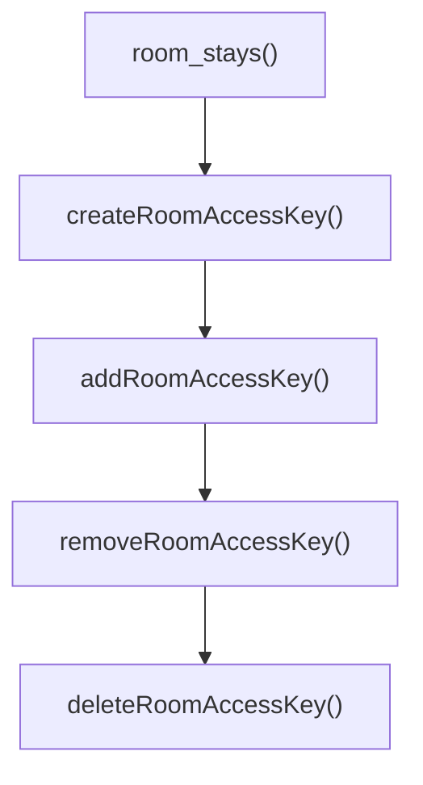

Room Access Key API is used to read or write room door pin numbers, key storage pin, or other type of room access types. *Room Access Key* is a generic name for anything that gives guest access to the room - pin, physical key or other types of access in the future. This API allows to:

* Reading the PIN to, for example, send the guest an sms with their room's number and PIN. We expect most integrations to care only about reading Room Access Keys.
* For door lock or key storage integrators, inform 3RPMS of what Room Access Key is being used for a reservation, for other integrations to use.

### Reading Room Access Key

For most integrations only reading PIN will be relevant.

Currently two types of PINs can be present on a room:

* `RoomAccessPin` is used for pins with direct access to the room and used for the entire duration of the stay, e.g., door locks
* `RoomAccessKeyStorage` is used for key storage that, after entering pin, will give the guest a physical key to use. This pin is meant to be used only once on arrival, and may not function after.
* `RoomAccessQR` is used for locks with a QR code scanner. This key type contains data to generate a QR code.

#### Example query

$$INFO
title: Forwards compatability
New Room Access Key types may be added at any time. Your integration must handle cases when `roomAccessKey` returns a type not queried for.
$$

Given a reservation room's id, to retrieve a Room Access Key for a specific room:

```graphql
# Variables:
# {
#   "roomId": "<room id>"
# }
query RoomAccessKey($roomId:ID!) {
  room_stays(filter:{id:{eq:$roomId}} first:1) {
    edges {
      node {
        room_setup { name }
        roomAccessKey {
          ... on RoomAccessPin { pin }
          ... on RoomAccessKeyStorage { pin }
          ... on RoomAccessQR { qrData }
        }
      }
    }
  }
}
```

A reservation may contain multiple rooms, and each room may have a different Room Access Key. To retrieve keys for all rooms inside a reservation, when you have the reservation's code (not to be confused with reservation's id):

```graphql
# Variables:
# {
#   "reservationCode": "<reservation code>",
#   "roomCursor": null
# }
query ReservationRoomAccessKeys($reservationCode:String! $roomsCursor:String = null) {
  reservations(filter:{code:{eq:$reservationCode}}) {
    edges {
      node {
        rooms(first:20 after:$roomsCursor) {
          edges {
            node {
              room_setup { name }
              roomAccessKey {
                ... on RoomAccessPin { pin }
                ... on RoomAccessKeyStorage { pin }
                ... on RoomAccessQR { qrData }
              }
            }
          }
          pageInfo { hasNextPage endCursor }
        }
      }
    }
  }
}
```

In the response, `roomAccessKey.pin` can be an alpha-numerical string with length up to 10 characters, or `qrData` in case of a QR code Room Access Key type. `RoomAccessKeyStorage` will also contain a `compartment` field, but that must not be shown to end guests.

$$WARNING
title: Pagination
A reservation can contain more rooms than can be returned with one request. Make sure to use `pageInfo.hasNextPage` and `pageInfo.endCursor` to read subsequent pages.
$$

#### Room Access Key Changes

Room access key can change at any time before arrival, or during stay. See [webhooks guide](#webhooks-overview), if your integration requires the latest room access keys.

### Writing Room Access Key

$$WARNING
title: Intended Use
This section is relevant **only for door lock or key storage integrations**. Writing room access keys only informs 3RPMS of how to access the room. If your integration does not control any keys, these writes wont do anything.
$$

#### Basic Flow



1. `room_stays()` reads relevant Room Stay entries.
2. `createRoomAccessKey()` creates a room access key. Until added to a room stay, this will not be visible to users or other integrations.
3. `addRoomAccessKey()` assigns a room access key to a room stay. Recommended to do this at least a day before arrival, so that arrival instructions can be sent to guest beforehand.
    * Integrations can add only keys it has created with `createRoomAccessKey()`
    * Same key can be assigned to multiple rooms at the same time
    * Each room stay can have only one key assigned to it.
4. `removeRoomAccessKey()` removes room access key from a room stay.
    * Integrations can remove only its own keys
5. `deleteRoomAccessKey()` deletes a room access key; it has to be removed from any room stays first. 3RPMS will delete keys 2 days after departure (or 2 days after not being assigned to any room).
    * Integrations can delete only keys its own keys

#### 1\. Retrieve Room Stays

Bookings could be made months or years in advance, yet only bookings a few days in advance are relevant. 3RPMS recommends to store data only for the upcoming 7 days, and:

1. Do one initial data poll when integration is connected
2. Nightly synchronization for new dates

For example, to query for room stays from January 30th + next 6 days:

```graphql
# Variables
# {
#   "start": "2026-01-30",
#   "end": "2026-02-05"
# }
query RoomStays($start:Date! $end:Date! $cursor:String=null) {
  room_stays(filter:{reservation_from:{le:$end} reservation_to:{gt:$start}} first:20 after:$cursor) {
    edges {
      node {
          ...RoomStaySubset
      }
    }
    pageInfo {
      endCursor
      hasNextPage
    }
  }
}

fragment RoomStaySubset on RoomStay {
  id
  room_setup { id }
  arrival: reservation_from
  departure: reservation_to

  # In some cases, a newly created room stay may use an already existing room access key,
  # for example, when an existing room stay is split in two separate ones.
  roomAccessKey { id }
}
```

New bookings could be created just before arrival. In addition Room Stay arrival, departure and physical room can change at any time. How to respond to these changes is described in [Listen for Room Stay Changes](#guides-using-room-access-keys-4-listen-for-room-stay-changes) section.

#### 2\. Create a Room Access Key

There are three types of room access keys - `RoomAccessPin`, `RoomAccessKeyStorage` and `RoomAccessQR`. Any one of them can be created with the same mutation, by providing different inputs:

```graphql
mutation CreateRoomAccessKey($input:CreateRoomAccessKeyInput!) {
    createRoomAccessKey(input:$input) {
        roomAccessKey { id }
    }
}
```

In response, you'll get an `id` that you need to save, to assign to a room stay and keep track of.

$$generic
=== "RoomAccessPin"
`RoomAccessPin` type's use case is when a pin unlocks a door directly. This type has one required field:

    * `pin` that guest will use to open the door. Up to 10 alpha-numeric characters. Both uppercase and lowercase is allowed, but not both at the same time.
    
    Variable structure to use for this type, with the previously mentioned mutation:
    
    ```json
    {
      "input": {
        "roomAccessPin": {
          "pin": "1234567890"
        }
      }
    }
    ```
=== "RoomAccessKeyStorage"

    `RoomAccessKeyStorage` use case is when a pin is used to on arrival get a physical key that is then used for the duration of the stay. This type has two required fields :
    
    * `pin` that guest will use to access key storage. Up to 10 alpha-numeric characters. Both uppercase and lowercase is allowed, but not both at the same time.
    * `compartment` where hotel staff will place the key. Usually not relevant for guests. Up to 10 alphanumeric characters.
    
    Variable structure to use for this type, with the previously mentioned mutation:
    
    ```json
    {
      "input": {
        "roomAccessKeyStorage": {
          "pin": "1234567890",
          "compartment": "3R"
        }
      }
    }
    ```

=== "RoomAccessQR"

    `RoomAccessQR` use case is when a room's door can be opened by scanning a QR code. This type has one required field:

    * `qrData` Data being used to generate QR code. Up to 512 characters are allowed.

    Variable structure to use for this type, with the previously mentioned mutation:

    ```json
    {
      "input": {
        "roomAccessQR": {
          "qrData": "abcdefgh1234567890"
        }
      }
    }
    ```
$$

#### 3\. Assign a Room Access Key

A newly created room access key will not be used for anything. For hotel staff and other systems to be aware of a Room Access Key, it has to be assigned to a Room Stay. Assignment is done the same way for all Room Access Key types:

```graphql
# Variables:
# {
#   "addRoomAccessKey": {
#     "roomStayId": "<room stay id>",
#     "roomAccessKeyId": "<room access key id>"
#   }
# }
mutation AddRoomAccessKey($addRoomAccessKey: AddRoomAccessKeyInput!) {
  addRoomAccessKey(input:$addRoomAccessKey) {
    roomStay {
      room_setup { id name }
      arrival: reservation_from
      departure: reservation_to
      roomAccessKey { id }
    }
  }
}
```

$$INFO
title: Recommendation
Room Access Key should be assigned to the room at least a day before arrival, to allow sending out arrival instructions.
$$

#### 4\. Listen for Room Stay Changes

New bookings could be created just before arrival, or a reservation could be cancelled last minute. In addition Room Stay arrival, departure and physical room can change at any time. Your integration must respond to these changes to ensure the Room Access Key works when, for example, a Room Stay is moved up by a week.

Scenarios to handle:

* Arrival/Departure change
* Room Stay moved to a different physical room
* Room Stay deleted
* Reservation cancelled or re-activated
* Room Stay created

Most scenarios are applicable only when using door pin, but some are relevant for key storage or other key types as well. 3RPMS recommends setting up a webhook to react to these changes in realtime:

* `room_stay.created` \- Add Room Access Keys to last-minute bookings\.
* `room_stay.updated` \- Changes to arrival, departure or physical room may be of interest\.
* `room_stay.deleted` \- When a room stay that had your integration's key assigned, is deleted, your integration may need to remove some access on your side\.
* `reservation.updated` \- When a reservation that had your integration's key assigned, is cancelled, your integration may need to remove some access on your side\. Similarly, when a reservation is activated\.
* `room_access_key.deleted`

See [webhooks guide](#webhooks-overview) on how to use them.

Upon receiving a webhook, retrieve the data your integration needs:

```graphql
# Variables
# {
#   "ids": ["<room stay id 1>", "<room stay id 2>"]
# }
query RoomStay($ids:[ID!]!) {
    room_stays(filter:{id:{in:$ids}}) {
        edges {
            node {
                ...RoomStaySubset
            }
        }
    }
}

fragment RoomStaySubset on RoomStay {
    id
    room_setup { id }
    arrival: reservation_from
    departure: reservation_to

    # In some cases, a newly created room stay may use an already existing room access key,
    # for example, when an existing room stay is split in two separate ones.
    roomAccessKey { id }
}
```

#### 5\. Revoke a Room Access Key

A Room Stay can have only on Room Access Key assigned. To change pin, or assign a different Room Access Key, the previous one has to be revoked. This is the same for all Room Access Key types:

```graphql
# Variables
# {
#   "removeRoomAccessKey": {
#     "roomStayId": "<room stay id>",
#     "roomAccessKeyId": "<room access key id >"
#   }
# }
mutation RemoveRoomAccessKey($removeRoomAccessKey:RemoveRoomAccessKeyInput!) {
  removeRoomAccessKey(input:$removeRoomAccessKey) {
    roomStay {
      id
      roomAccessKey {
        id
      }
    }
  }
}
```

#### 6\. Delete a Room Access Key

After departure, or when your integration knows the key is no longer needed, its recommended to delete the room access key. Only Room Access Keys that have not been assigned to any rooms can be deleted.

```graphql
# Variables
# { 
#   "roomAccessKeyId": "abc"
# }
mutation DeleteRoomAccessKey($roomAccessKeyId:ID!) {
  deleteRoomAccessKey(input:{roomAccessKeyId: $roomAccessKeyId}) {
    deleted
  }
}
```

$$WARNING
title: Cleanup
3RPMS will revoke and delete Room Access Keys 2 days after room stay departure, or 2 days of not being assigned to any room. Such Room Access Keys are assumed to be no longer used.
$$

#### Rate Limits

Handling Room Access Keys updates for many Room Stays at the same time can cause exceeding [rate limits](#graphql-api-rate-limiting). To prevent this, [batch your queries](#graphql-api-extra-features-using-batches) in as few requests as possible. For example:

1. Request: Query for rooms within the stay period
2. Request: Create all Room Access Keys
3. Request: Assigning new Room Access keys, Revoking and Deleting old Room Access Keys

To reduce requests even further, 2nd and 3rd request can be combined by interlieving the queries and using [Chained Operations](#graphql-api-extra-features-chained-operations): Create, Assign, Create, Assign, Revoke, Revoke, Delete, Delete
